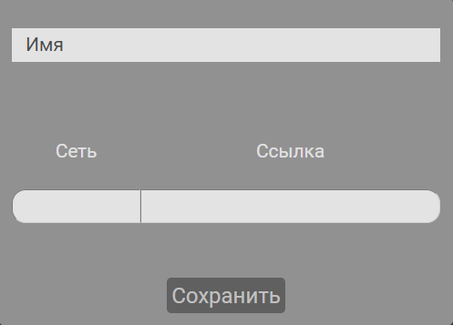

<h1 align="center">myContacts</h1>
<p align='center'></p>

## Описание
Сайт служит хранилищем контактов со ссылками на их соц. сети.

### Страницы сайта
Всего на сайте три страницы, к двум из которых ограничен доступ для неавторизованных пользователей.

#### Основная страница. Путь */*
Здесь можно просмотреть имеющийся список контактов, изменить/удалить их и добавить новые.
Также есть возможность их отфильтровать по новизне или алфавиту.

<p align='center'></p>

Страница доступна только для авторизованных.

##### Оформление контакта
Сохранить или изменить контакт можно только в том случае, если заполнены необходимые поля. Требуется ввести имя и хотя бы одно сочетание <сеть/ссылка>. 



Строка для нового сочетания <сеть/ссылка> появляется автоматически при заполнении вышестоящей строки.

#### Страница аутентификации. Путь  */auth*
Аутентификация проводится с помощью почты и пароля. На странице можно войти в имеющийся аккаунт или зарегистрировать новый.

<p align='center'></p>

#### Страница для неопознанных путей
Открывается при вводе всех остальных путей. Доступна только авторизованным пользователям: неавторизованные перенаправляются на */auth*.

<p align='center'></p>

### Анимация загрузки
Запросы на сервер, как обработка аутентификационных данных, загрузка контактов и отправка контакта на сохранение сопровождаются загрузочным спиннером.


### Уведомления
Используемые уведомления можно разделить на два типа:

 - Появляющиеся под формой
 - Всплывающие в углу экрана

Уведомления под формой появляются при их неверном заполнении. На сайте два вида форм: заполнения контакта и аутентификации.


Такие уведомления подсказывают, что было введено неверно.

Следующий тип - всплывающие уведомления - сообщают статус операций с сервером, не связанных с неверным заполнением формы.
Такое уведомление имеет один из четырёх статусов, что определяет его цвет: 
 - ошибка `#ffaba5` 
 - предупреждение `#fffaa3`
 - успех `#8bd18b`
 - статус копирования `#b7b7b7`


## Авторизация
Возможность пользователя получить доступ к функционалу сайта - а именно к просмотру контактов, их созданию, изменению, удалению - зависит от наличия у него валидного токена, что реализовано с помощью JSON Web Token.
После успешной аутентификации пользователю отправляется два токена:

 - access-token - используется для авторизации; имеет короткий срок действия
 - refresh-token - используется для обновления access-token; имеет долгий срок действия
 
Далее они сохраняются в localStorage. 
В каждом запросе к серверу будут находится токены.
Если валиден только refresh-token, - оба токена будут обновлены и отправлены обратно, что ими и дальше можно было пользоваться.
В случае, если оба токена невалидны, пользователь будет переведён на стрицу аутентификации. 

## Хранение данных
Хранение данных пользователей осуществлено с помощью mongoDB. 

## Установка и запуск

### Установка
```bash
npm run install-dev
```
Этот скрипт установит пакеты back- и front-end` а.

### Предварительные настройки
#### back-end
Для работы back-end`а нужно настроить конфиг. Для этого создаём папку config и в ней default.json. Туда вносим значения в следующие переменные:
```json
{
	"MONGO_URI": "",
	"SECRET_ACCESS_JWT_KEY": "",
	"SECRET_REFRESH_JWT_KEY": "",
	"PORT": 
}
```
#### front-end
В ./client/src/setupProxy.js заменяем, если нужно, `target` - ссылку на back-end.

### Запуск
```bash
npm run dev